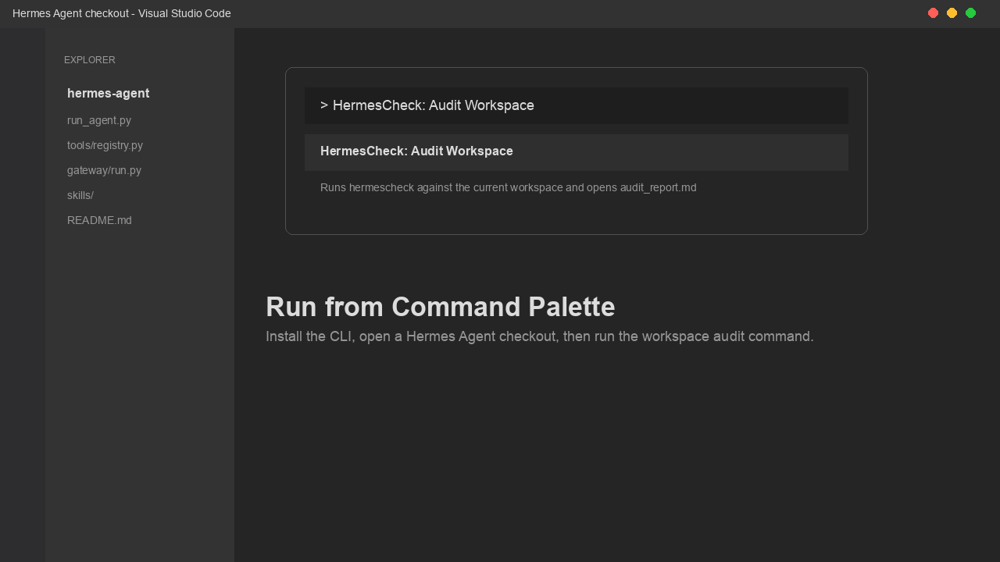
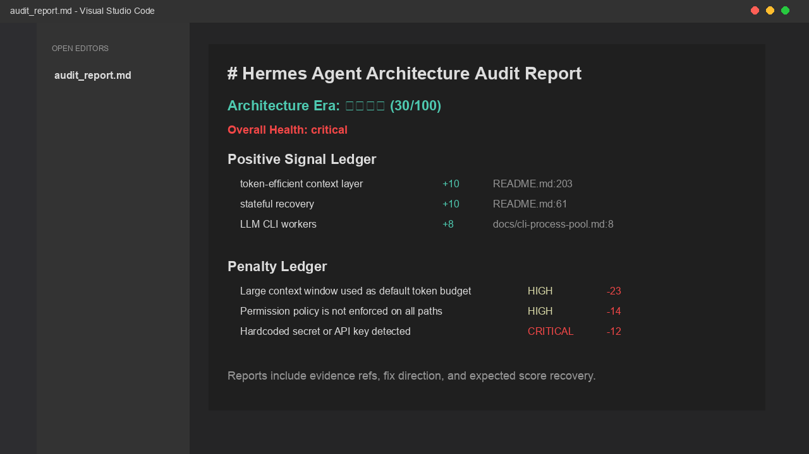
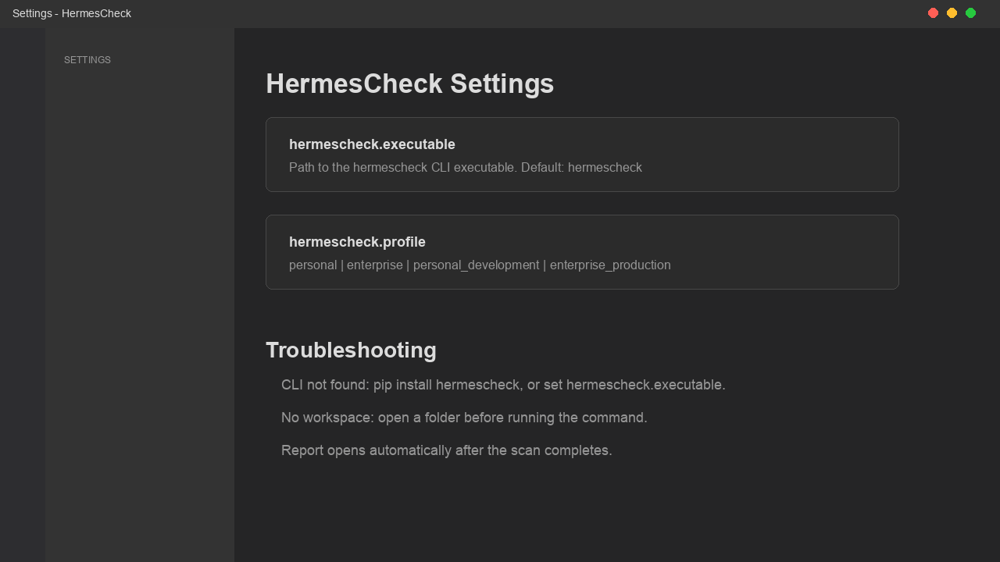

# HermesCheck

Run Hermes Agent architecture and runtime health checks from VS Code.

HermesCheck is a small VS Code wrapper around the `hermescheck` CLI. It audits a
Hermes Agent checkout or fork, writes structured JSON and Markdown reports, and
opens the Markdown report inside VS Code when the scan completes.



## What It Checks

- Hermes runtime-contract drift across CLI, TUI, gateway, skills, cron, memory, plugins, and command registries.
- Agent architecture issues such as hidden LLM calls, completion gaps, role-play handoff chains, and tool-enforcement gaps.
- Token budget problems, including large default context windows and full-history prompt assembly without thrift controls.
- Runtime safety risks such as loop budgets, daemon restart safety, plugin sandboxing, remote tool boundaries, and pipeline middleware integrity.
- Score evidence through a positive signal ledger, penalty ledger, fix directions, and expected score recovery.



## Quick Start

1. Install the `hermescheck` CLI:

   ```bash
   pip install hermescheck
   ```

2. Open a Hermes Agent checkout or fork in VS Code.
3. Open the command palette:

   ```text
   Cmd+Shift+P
   ```

4. Run:

   ```text
   HermesCheck: Audit Workspace
   ```

The extension writes JSON and Markdown audit outputs to a temporary directory
and opens the Markdown report after the scan completes.

## Output

Each run produces:

- `audit_results.json`: machine-readable report matching `hermescheck.report.v1`.
- `audit_report.md`: human-readable report opened automatically in VS Code.

The Markdown report includes:

- overall health and architecture era score
- severity summary
- positive signal ledger
- penalty ledger
- evidence references
- ordered fix plan

## Settings



- `hermescheck.executable`: path to the `hermescheck` CLI. Defaults to `hermescheck`.
- `hermescheck.profile`: audit profile passed to the CLI. Defaults to `personal`.

Profiles:

- `personal`: local forks, experiments, solo operator setups.
- `enterprise`: stricter production checks.
- `personal_development`: broader development-time scanner set.
- `enterprise_production`: stricter team/production profile.

## Troubleshooting

### `hermescheck` command not found

Install the CLI:

```bash
pip install hermescheck
```

If the command is installed in a custom path, set `hermescheck.executable` to the
absolute executable path.

### No workspace folder is open

Open a folder in VS Code before running `HermesCheck: Audit Workspace`.

### The report shows many findings in tests or fixture files

Run the CLI directly for advanced options and targeted paths:

```bash
hermescheck /path/to/hermes-agent --profile personal -o audit_results.json -r audit_report.md
```

## Links

- GitHub: https://github.com/huangrichao2020/hermescheck
- CLI package: https://pypi.org/project/hermescheck/
- Issues: https://github.com/huangrichao2020/hermescheck/issues
